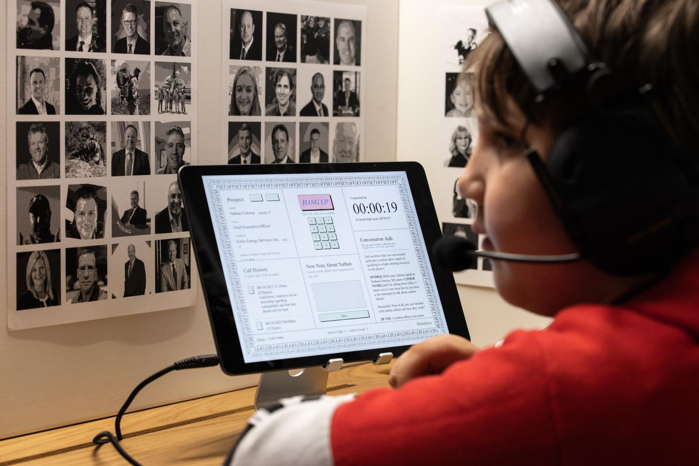
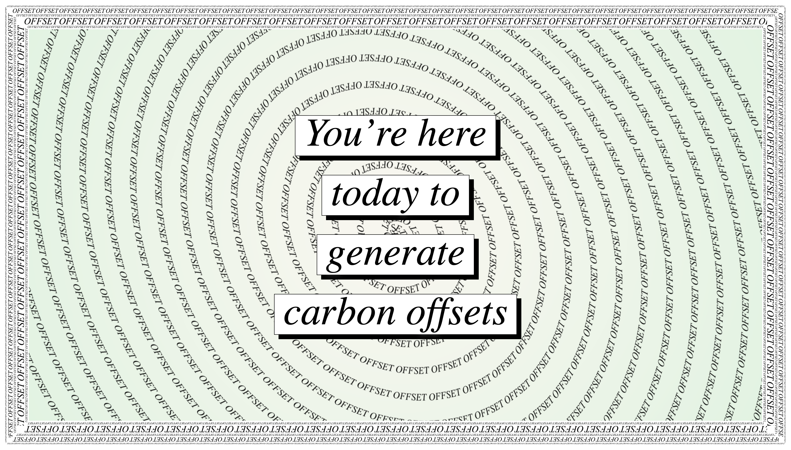
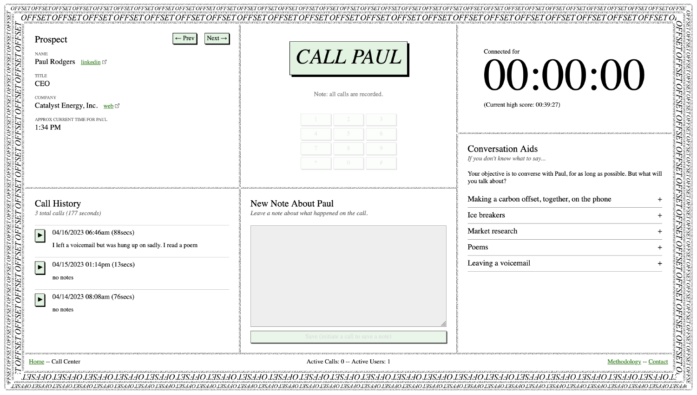
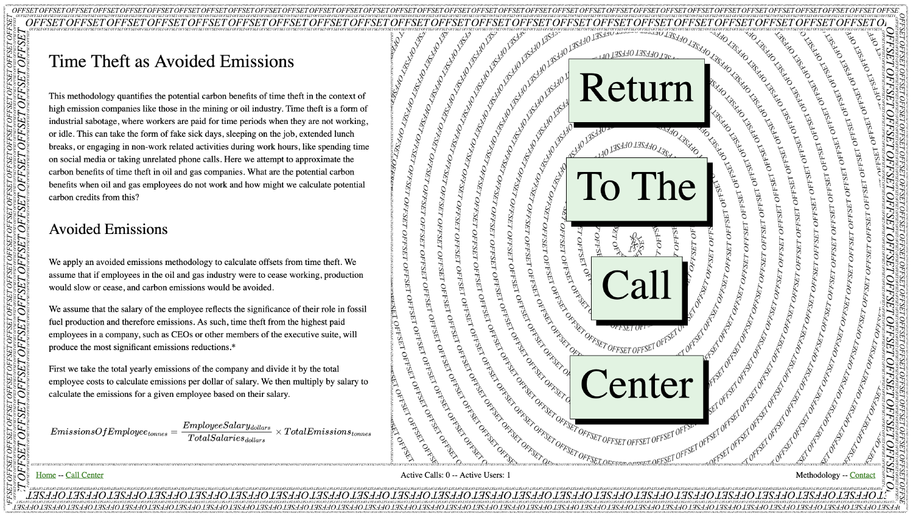
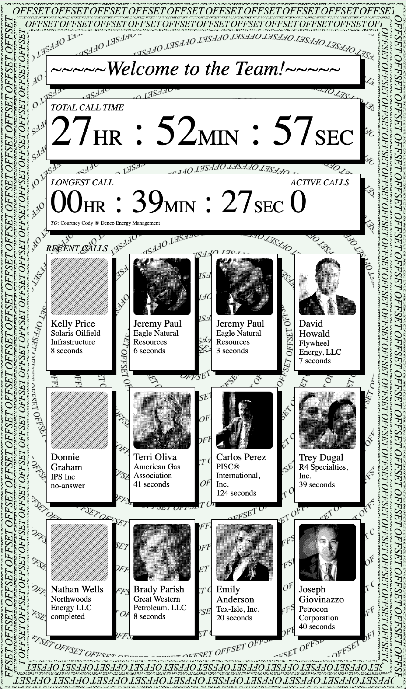

##### 2023 - web, call center, phone numbers
*Cold Call: Time Theft as Avoided Emissions* is an unconventional carbon offsetting scheme that draws on strategies of worker sabotage and applies them in the context of high emission companies in the fossil fuel industry. Time theft is a strategy to deliberately slow productivity, where workers waste time and are therefore paid for periods of idleness. For example, fake sick days, sleeping on the job, extended lunch breaks, or engaging in non-work related activities like social media or unrelated phone calls. 

*Cold Call* is an installation that takes the form of a call center. Audiences are invited to connect by telephone to executives in the fossil fuel industry and instructed to keep them on the phone as long as possible. The cumulative time stolen from these executives is then quantified as carbon credits using an innovative new offsetting methodology. Read the white paper, Time Theft as Avoided Emissions, that describes the methodology [here](time_theft_as_avoided_emissions.pdf). 

Commissioned by the 2023 [STRP Festival](https://strp.nl/), Eindhoven. 

###### Photo by Boudewijn Bollmann

###### Photo by Boudewijn Bollmann

###### Photo by Boudewijn Bollmann

###### Photo by Boudewijn Bollmann

###### Photo by Boudewijn Bollmann

###### Photo by Boudewijn Bollmann

###### Photo by Boudewijn Bollmann

###### Photo by Luka Carlevaris

###### Photo by Walter Wlodarczyk

###### Photo by Walter Wlodarczyk

<iframe title="video-player" src="coldcall.mp4" width="640" height="360" frameborder="0" referrerpolicy="strict-origin-when-cross-origin" allow="autoplay; fullscreen; picture-in-picture; clipboard-write; encrypted-media; web-share"   allowfullscreen></iframe>
