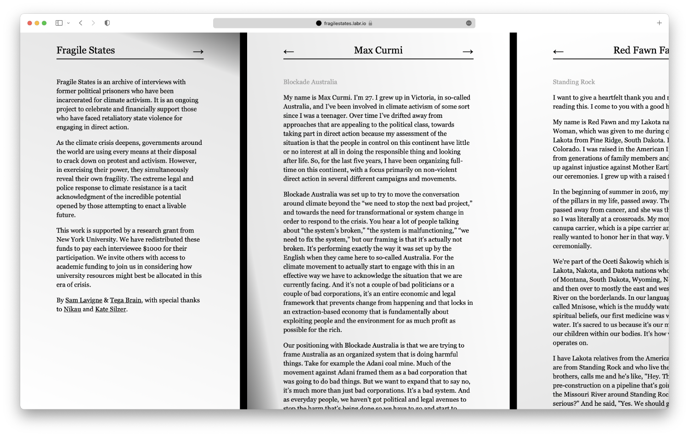
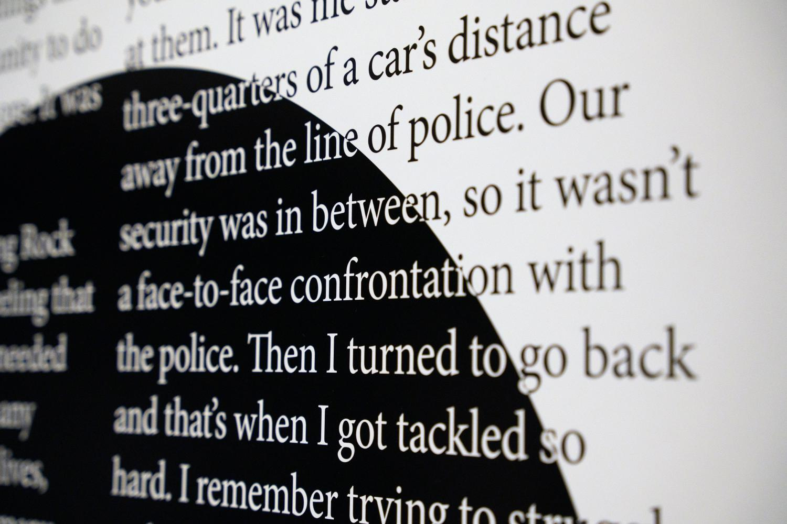
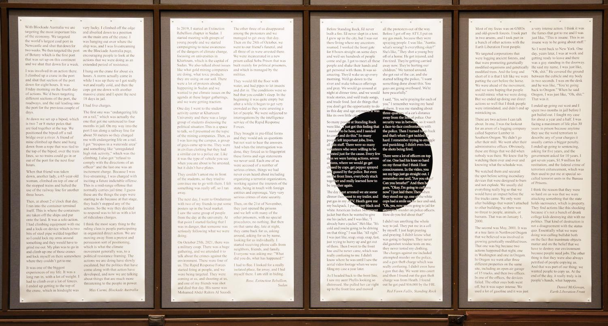

##### 2022 - online, print

[https://fragilestates.labr.io](https://fragilestates.labr.io)

*Fragile States* is an archive of interviews with former political prisoners who have been incarcerated for climate activism. It is an ongoing project to celebrate and financially support those who have faced retaliatory state violence for engaging in direct action. 

Excerpts from the interviews are presented as a series of prints that are punctated by a black circle, sized at the diameter of the Dakota Access Pipeline. Still in operation, this pipline transports 750, 000 barrels or 119, 240 cubic meters of crude oil per day through the environmentally sensitive lands of Lake Oahe, a major source of drinking water for the Standing Rock Sioux and the Cheyenne River Sioux tribes. 

*Fragile States* is supported by NYU’s “This is not a Drill” initiative. 

###### Exhibition detail, 'Tega Brain and Sam Lavigne – Fragile States: New York City', New York University, 2023. © the artists. Photo: Tega Brain

###### Exhibition detail, 'Tega Brain and Sam Lavigne – Fragile States: New York City', New York University, 2023. © the artists. Photo: Tega Brain

### Credits

Commissioned by the This is Not a Drill project and the Future Imagination Fund at the NYU Tisch School of the Arts.

With special thanks to [Nīkau](https://nikau.io/) and [Kate Silzer](https://www.katesilzer.com/).