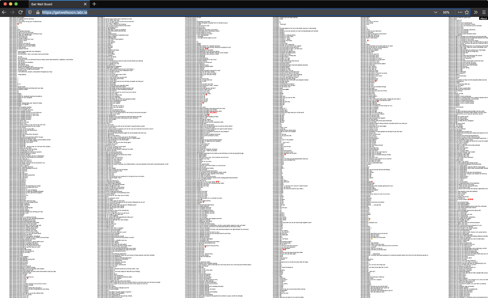
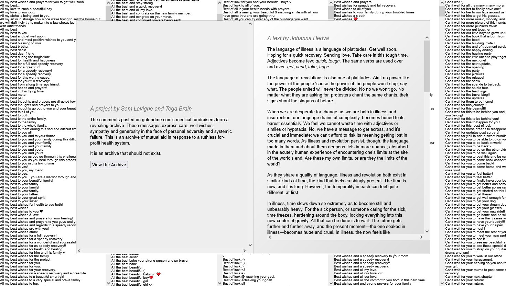
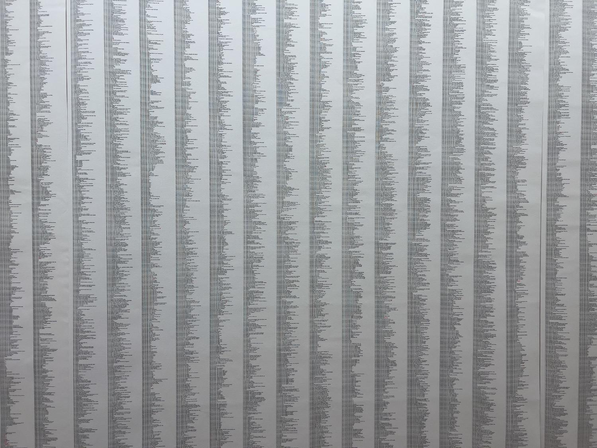
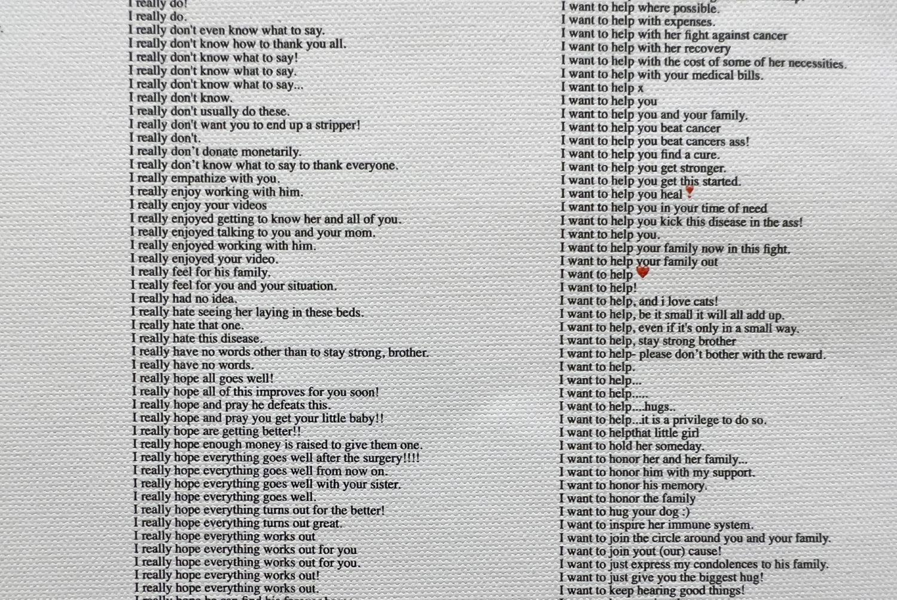

##### 2020 - online

[https://getwellsoon.labr.io](https://getwellsoon.labr.io)

Made during the onset of the COVID-19 pandemic, *Get Well Soon* is an online archive made from scraping the comments posted on the popular crowd funding site  [gofundme.com](https://www.gofundme.com/), a self-described “leader in online medical fundraising”. Due to a lack of affordable healthcare in the United States, GoFundMe is widely relied upon for funding vital medical procedures. 

The resultant collection of sentences are presented as a giant e-card and express well wishes, solidarity and geneousity. As networks of mutual aid emerge in the significant gaps left by public services, the work is the result of a ruthless for-profit health system that excludes so many.

The piece is accompanied by a short essay from [Johanna Hedva](https://johannahedva.com/).

It was shown as part of the online exhibit [We=Link](http://we-link.chronusartcenter.org/), co-commissioned by Chronus Art Center (Shanghai), Art Center Nabi (Seoul) and Rhizome of the New Museum (New York).

###### Photo by Beard and Weil Galleries

###### Photo by Beard and Weil Galleries

###### Photo by Beard and Weil Galleries

### Press/External

[ArtNews](https://www.artnews.com/list/art-news/artists/most-important-artworks-2020-1234578712/sam-levine-and-tega-brain-get-well-soon-2020/)

[NPR Morning Edition](https://www.npr.org/2020/09/29/904356894/artists-turn-gofundme-comments-into-a-get-well-soon-card-for-a-sick-system)

[Ocula](https://ocula.com/magazine/spotlights/we-link-chronus-art-center-shanghai/)

[Artsy](https://www.artsy.net/article/artsy-editorial-museums-finding-new-ways-connect-art-lovers-online-quarantine)

[Adroit Journal](https://theadroitjournal.org/2020/04/24/we-hurled-our-solitudes-together-cyber-identity-allyship-and-political-rhetoric-in-contemporary-media-part-three/)

[The Art Newspaper](https://www.theartnewspaper.com/2020/05/05/born-digital-the-stalwart-institutions-that-have-been-producing-online-art-since-long-before-covid-19)
