##### 2015 - edited IPCC reports, books, website, video, pdfs

[http://intergovernmentalpaneloncapitalism.org](http://intergovernmentalpaneloncapitalism.org)

The Intergovernmental Panel on Climate Change, founded by the United Nations in 1988, is the “leading international body for the assessment of climate change.” The organization is tasked with assessing and synthesizing research around climate change. Every few years it publishes a series of comprehensive reports on the current state of climate change research and knowledge. 

*The Intergovernmental Panel on Capitalism* is an effort to systematically modify all material published by the IPCC: through a series of automated procedures we replace every instance of the phrase “climate change” with the word “capitalism” in reports, web pages, images and video. The Intergovernmental Panel on Capitalism is a fictional world whose foundation is a one-line joke taken to its extreme conclusion. It is also a place to ask how international environmental discourse might directly engage with the overwhelming tension between environmental agendas and economic priorities. 

In the words of the Nobel Committee: “Action is necessary now, before capitalism moves beyond man’s control.” 

<iframe title="vimeo-player" src="https://player.vimeo.com/video/126856157?h=9fbc247d0a" width="640" height="360" frameborder="0" referrerpolicy="strict-origin-when-cross-origin" allow="autoplay; fullscreen; picture-in-picture; clipboard-write; encrypted-media; web-share"   allowfullscreen></iframe>

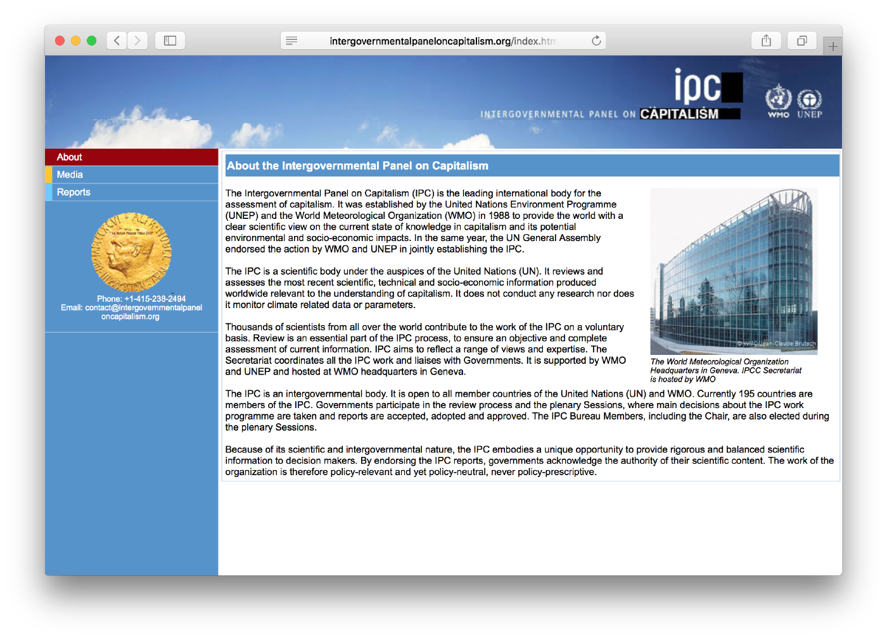

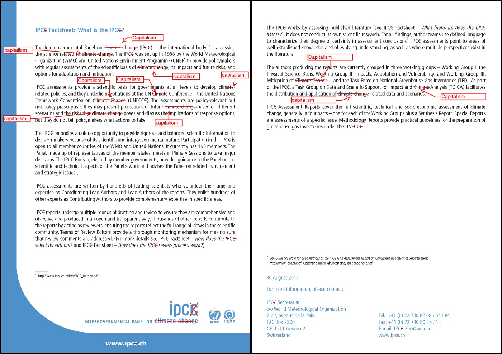
###### Intergovernmental Panel on Capitalism Factsheet

## The IPC Reports

The edited pdf versions of the [IPC reports can be downloaded on the IPC site](http://intergovernmentalpaneloncapitalism.org/reports.html) for printing. 

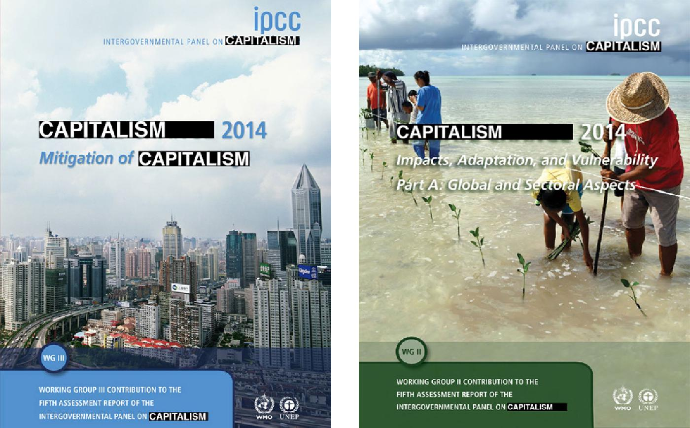
###### Altered Report Covers

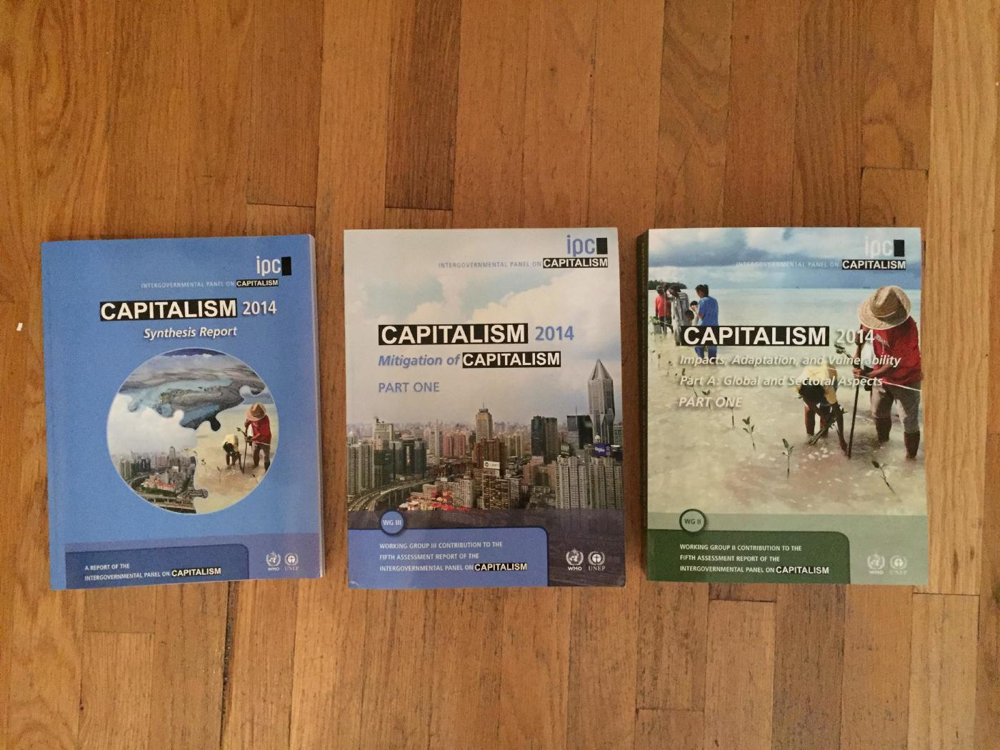
###### IPC Reports

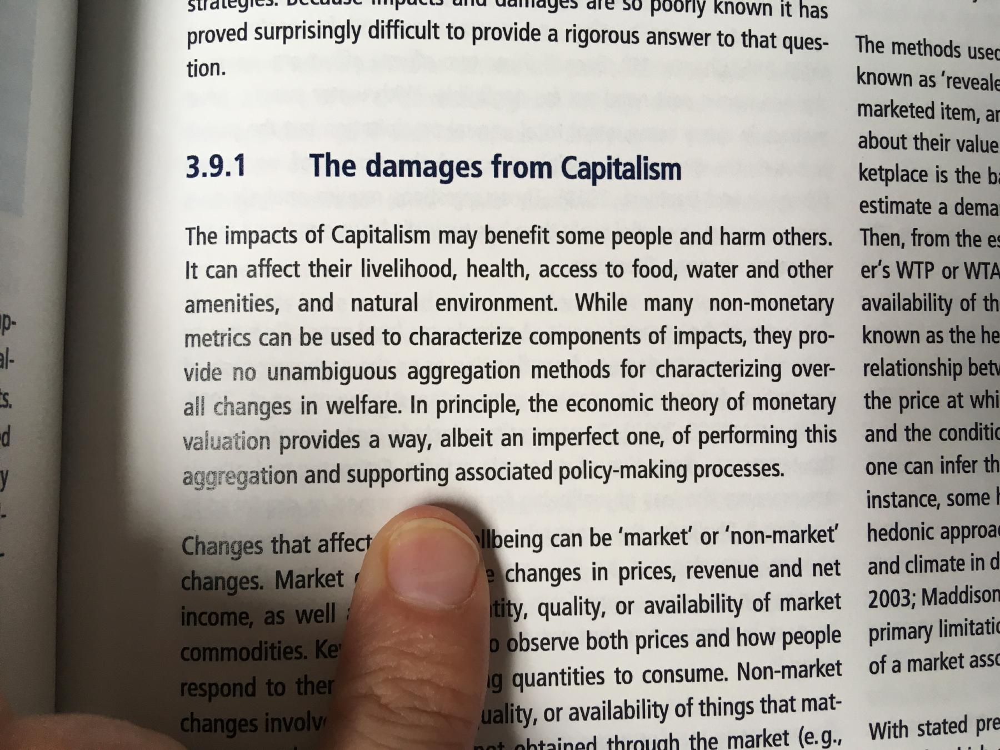

These reports are now filled with valuable insights on issues of human health, security, and environment: 

## Selected Excerpts

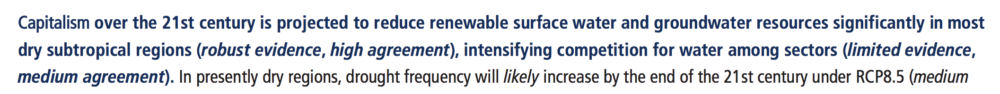
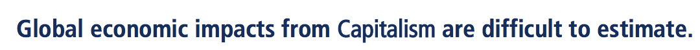
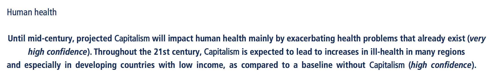
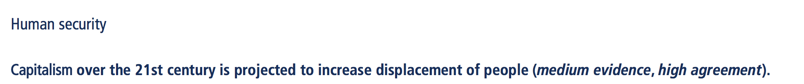
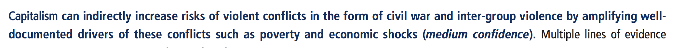
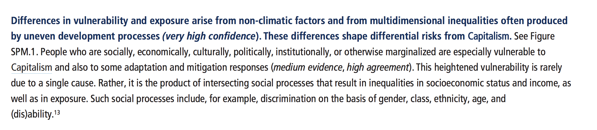
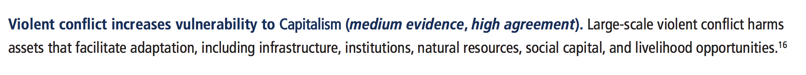
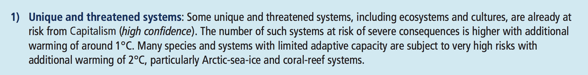
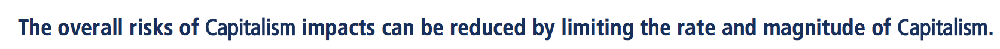

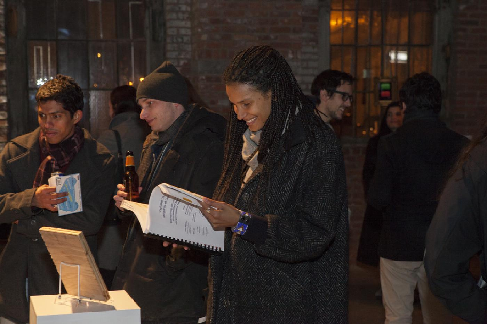
###### Exhibition view, Pioneer Works, New York. ‘Tega Brain and Sam Lavigne, 2015, Intergovernmental Panel on Capitalism.’ Image: David Huerta.

## The IPC Media Channel

The entire YouTube channel of the IPCC was editing using Sam Lavigne's [video grep tool](https://github.com/antiboredom/videogrep) and is available on the [IPC YouTube channel](https://www.youtube.com/channel/UC1d4gwOF0FIyf8pYwnOpI6Q). In each video, when the speaker's voice says "climate change" it is cut and replaced with a recording of the word "captialism" taken from a narrated audiobook of Thomas Piketty's book, *[Capital in the Twenty-First Century](https://en.wikipedia.org/wiki/Capital_in_the_Twenty-First_Century)*.

## Project Background

[The Intergovernmental Panel on Climate Change](http://www.ipcc.ch/) is an organization tasked with assessing and synthesizing (but not producing) research around climate change. Every few years they publish a series of comprehensive reports detailing the current state of climate change research and knowledge. In 2007, the Nobel Peace Prize was jointly awarded to Al Gore and the IPCC for “their efforts to build up and disseminate greater knowledge about man-made climate change, and to lay the foundations for the measures that are needed to counteract such change."
