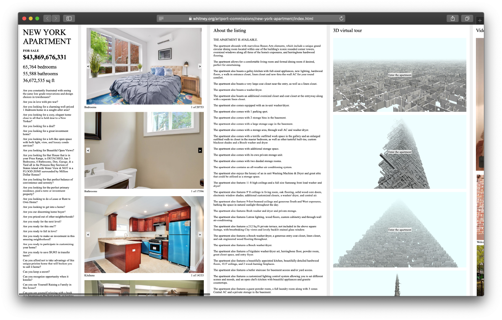
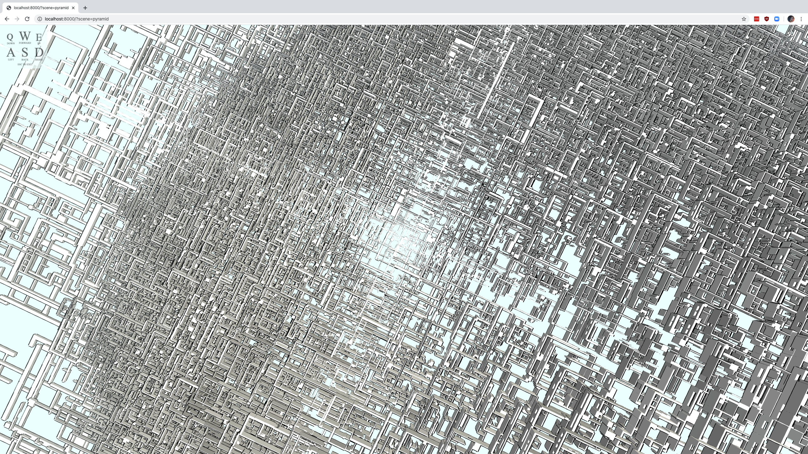
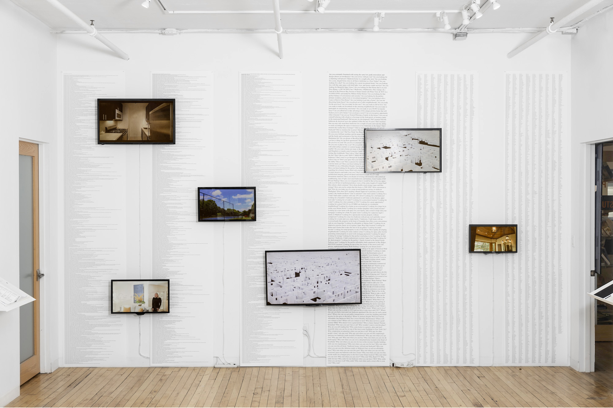

##### 2020 - online

[Enter Project](https://artport.whitney.org/commissions/new-york-apartment/index.html)

*New York Apartment* combines the totality of New York real estate into a single listing, compiling assets from every single for-sale listing in New York City. The work includes hundreds of thousands of images, video tours, descriptive sentences, 3d structures generated from extruded floor plans, and a mortgage calculator.

###### Project screenshot. ‘Tega Brain and Sam Lavigne – New York Apartment.' © the artists.

###### Project screenshot. ‘Tega Brain and Sam Lavigne – New York Apartment.' © the artists.

###### Apartment rendering. ‘Tega Brain and Sam Lavigne – New York Apartment.' © the artists. 

###### Exhibition view, Performing Documents: Modes of Assembling, Center for Book Arts, New York City. ‘Tega Brain and Sam Lavigne – New York Apartment.' © the artists.

### Credits

Commissioned by the Whitney Museum for the [Artport collection](https://whitney.org/artport), curated by Christiane Paul.

### Exhibitions

Performing Documents: Modes of Assembling, Center for Book Arts New York City, Jul 15–Sep 24, 2022

Spatial Affairs, The Ludwig Museum & ZKM | Center for Art and Media Karlsruhe, Budapest, 29th April 2021 – 27 June 2021

Whitney Museum of American Art, [Artport collection](https://whitney.org/artport), 2020 - present.

### Press

[Artforum Critics' Picks](https://www.artforum.com/picks/tega-brain-and-sam-lavigne-82840)

[New Yorker](https://www.newyorker.com/goings-on-about-town/art/sam-lavigne-and-tega-brain)

[Interview with on WNYC](https://www.wnyc.org/story/artport-whitney-museum)

[Brooklyn Rail](https://brooklynrail.org/2020/06/artseen/Sam-Lavigne-and-Tega-Brain-New-York-Apartment)

[Slate](https://slate.com/culture/2020/04/whitney-museum-new-york-apartment-exhibit-creators-interview.html)

[Artribune](https://www.artribune.com/progettazione/new-media/2020/03/appartamenti-new-york-vendita-progetto-web-sam-lavigne-tega-brain/)

[Apollo](https://www.apollo-magazine.com/artport-whitney-museum-american-art/)
