##### 2025

<iframe width="818" height="461" src="https://www.youtube.com/embed/tI1KHG5VSYc" title="Offset" frameborder="0" allow="accelerometer; autoplay; clipboard-write; encrypted-media; gyroscope; picture-in-picture; web-share" referrerpolicy="strict-origin-when-cross-origin" allowfullscreen></iframe>

[Offset](https://offset.labr.io/) is a carbon registry selling high-quality premium carbon credits generated from cases of direct action and industrial sabotage. Credits are represented by unique certificates printed in archival ink on photo rag, and the proceeds from each sale are donated back to the activists responsible for each direct action.

We analyze and quantify each case of direct action for its carbon benefit, translating this to credits using methods taken directly from the carbon accounting industry. If carbon offsetting extends the logic of quantification and finance to all aspects of human life, why haven't these interventions in the carbon cycle been counted before now?

Neutralize your emissions today by purchasing a premium carbon credit certificate from the [Offset Registry](https://offset.labr.io/). Or read more about this work on [Eflux](https://www.e-flux.com/architecture/spatial-computing/592129/all-that-is-air-melts-into-air).

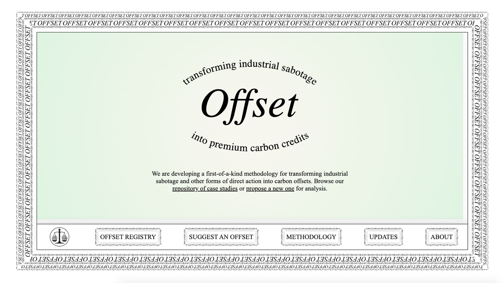
######  Screenshot of the Offset Carbon Registry accessible at: [https://offset.labr.io/](https://offset.labr.io/)

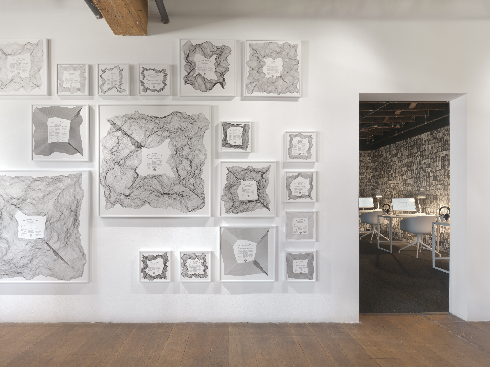
###### Exhibition views of Offset, in [How to Get to Zero](https://tegabrain.com/How-to-Get-to-Zero-exhibition) at Pioneer Works, Brooklyn.

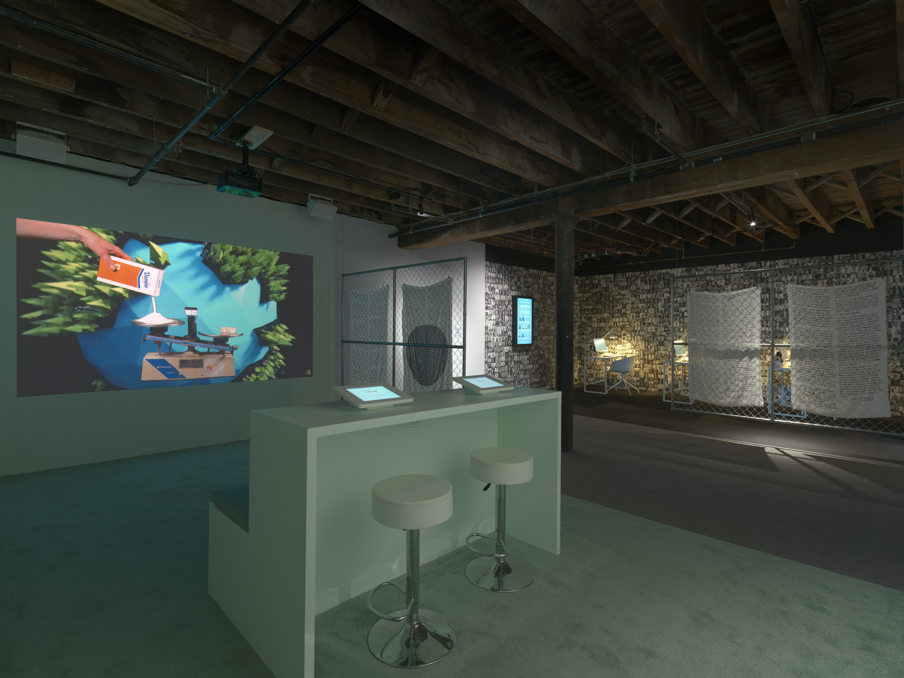

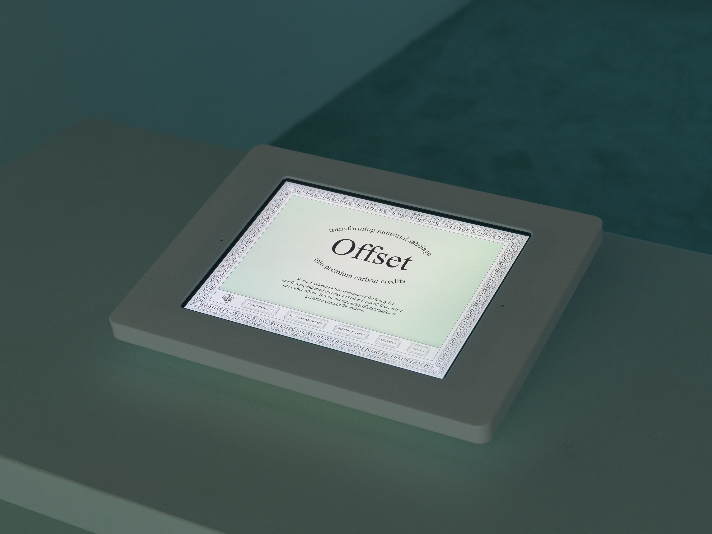

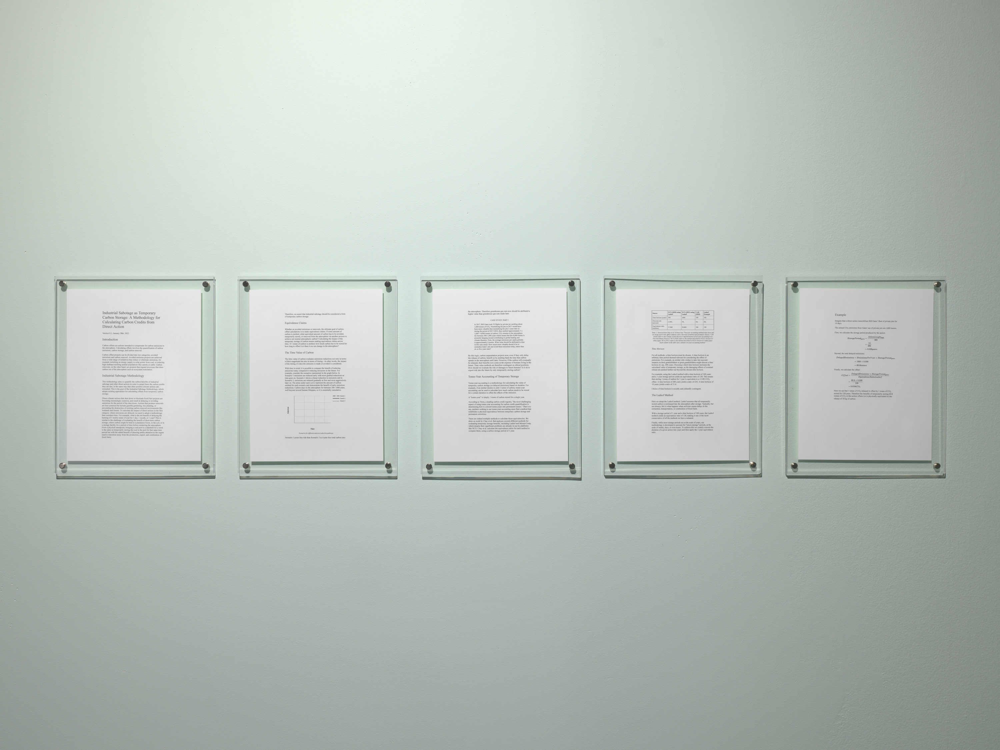

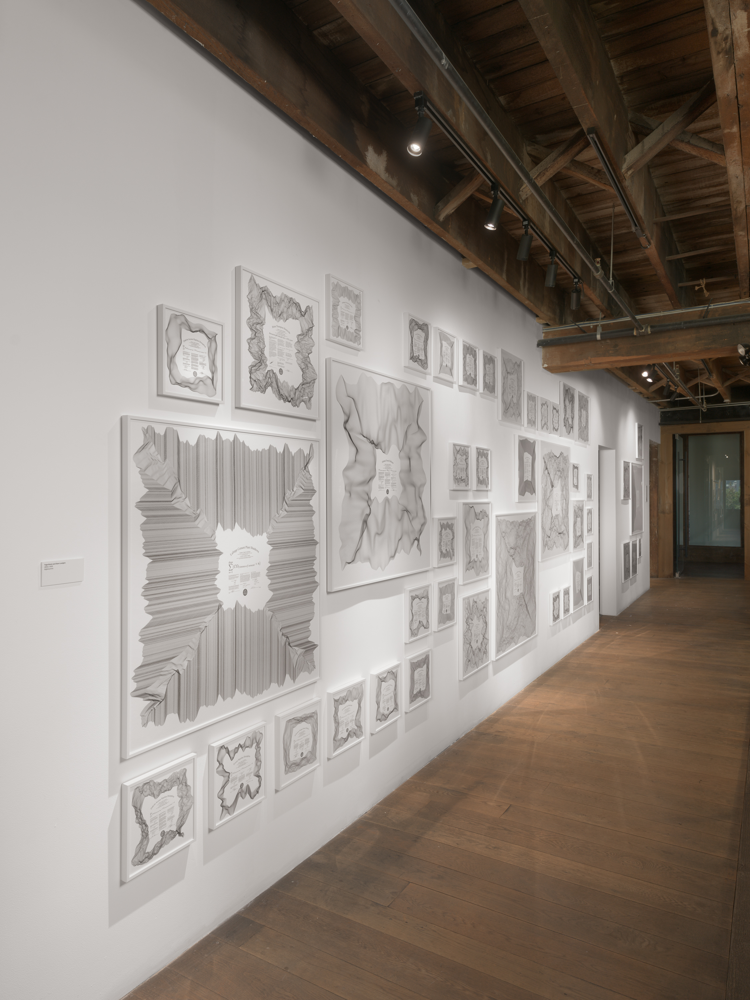

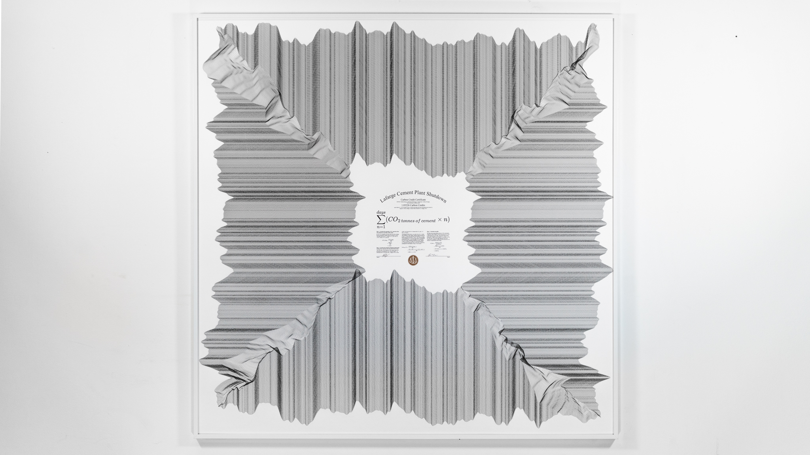
###### Carbon Credit Certificate for the Lafarge Cement Plant Shutdown, France, offsetting one metric tonne of carbon dioxide equivalent. Giclée on archival paper. 40 x 40 inches.

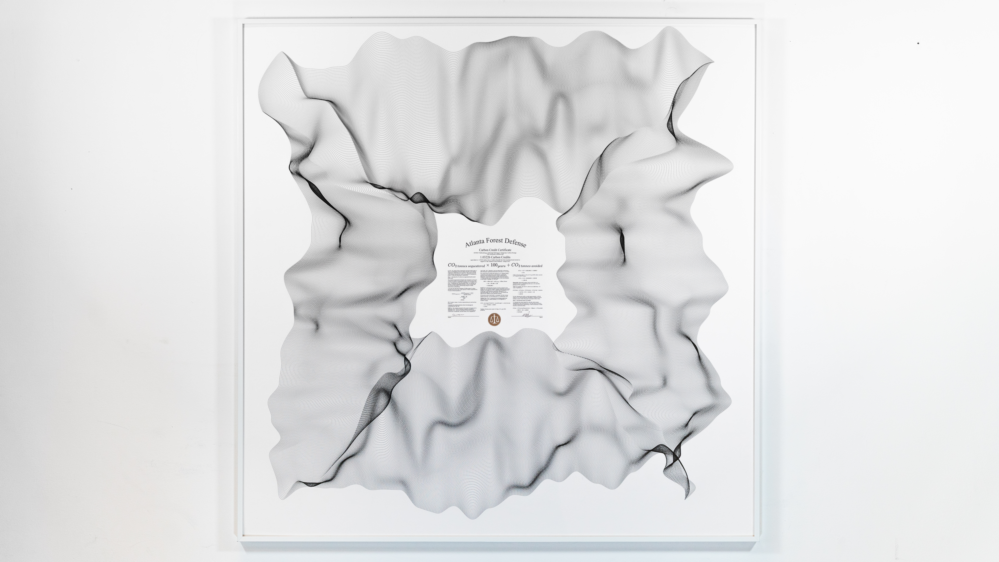
###### Carbon Credit Certificate for the Atlanta Forest Defense, USA, offsetting one metric tonne of carbon dioxide equivalent. Giclée on archival paper. 40 x 40 inches.

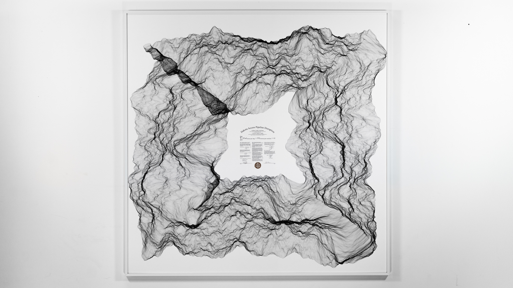
###### Carbon Credit Certificate for the Dakota Access Pipline Disruption, USA, offsetting one metric tonne of carbon dioxide equivalent. Giclée on archival paper. 40 x 40 inches.  

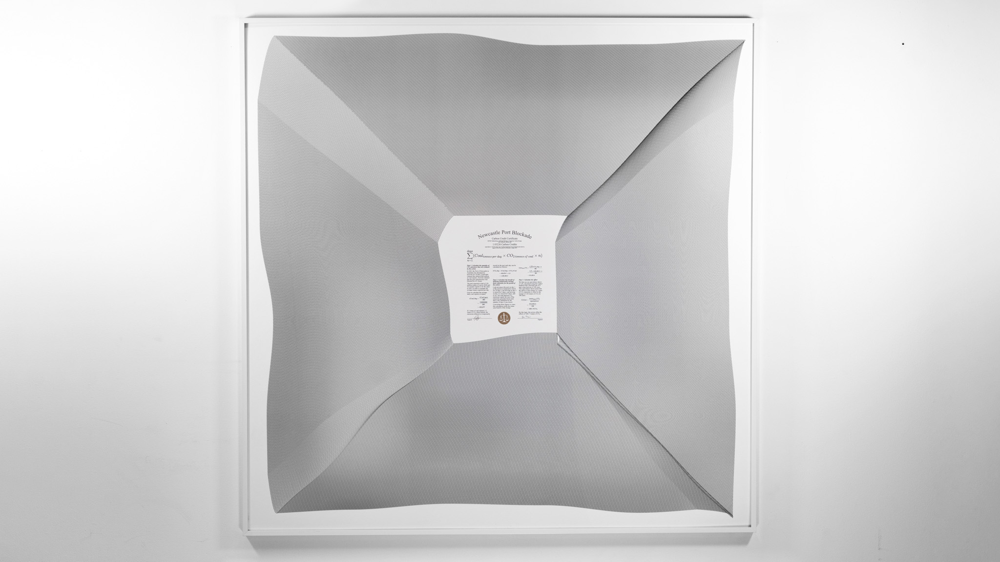
###### Carbon Credit Certificate for the Newcastle Port Blockade, Australia,  offsetting one metric tonne of carbon dioxide equivalent. Giclée on archival paper. 40 x 40 inches.  

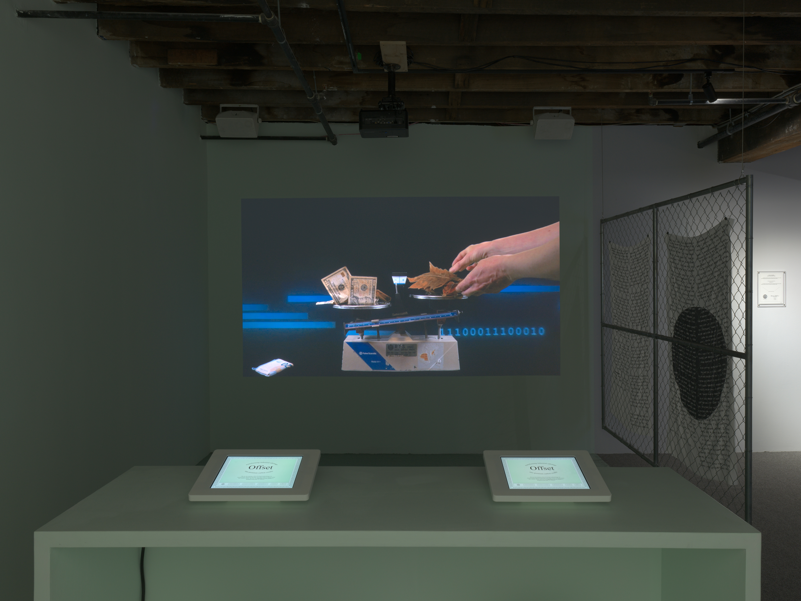

### Credits

Exhibition Design: Diogo Passarinho Studio

Fabrication assistance: Claire Hentschker and Brian Clifton

Graphic design and printing consultation: Sarah Yalaju and Beverly Acha

Video VFX: DJ (Dongjun) Kim

Printing: Brooklyn Editions

Studio assistant: Jacob Sheffet

Music consultation: Yotam Mann

#### Supported by:

A 2023 Creative Capital Award.

The Australian Center for Contemporary Arts

A Pioneer Works and Rockefeller Foundation working artist grant

### Press

[New York Times](https://www.nytimes.com/2025/10/30/arts/art-gallery-shows-to-see-in-november.html)

[Hell Gate](https://hellgatenyc.com/sam-lavigne-tega-brain-offset-pioneer-works/)

[The Art Newspaper](https://www.theartnewspaper.com/2025/10/14/tega-brain-sam-lavigne-pioneer-works-how-to-get-to-zero)

[Pioneer Works](https://pioneerworks.org/news/tega-brain-and-sam-lavigne-how-to-get-to-zero)