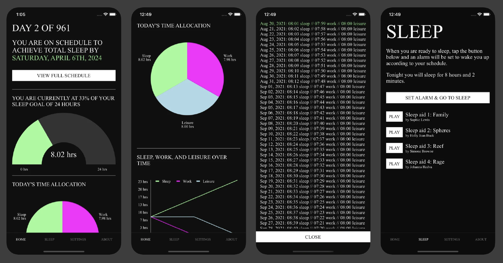
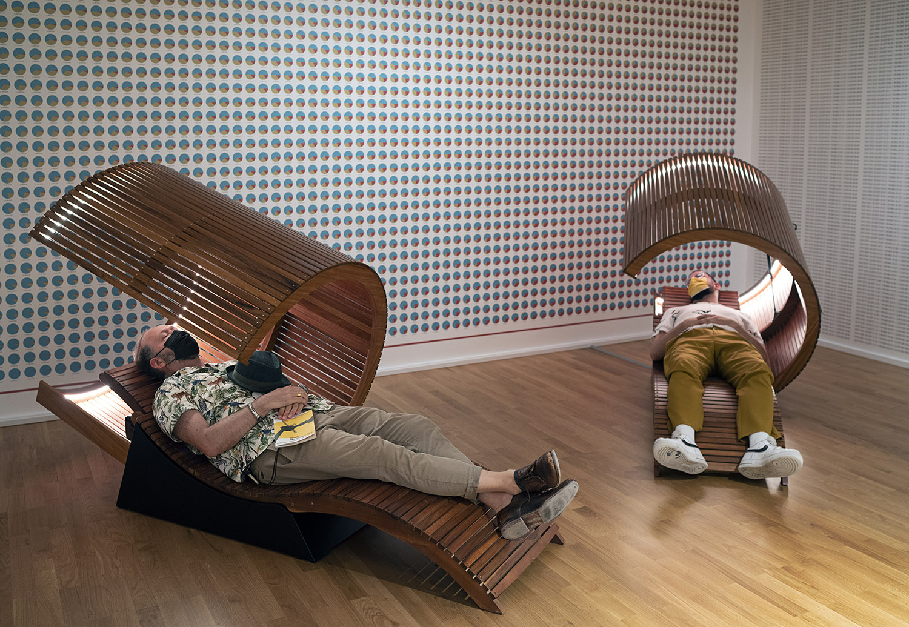
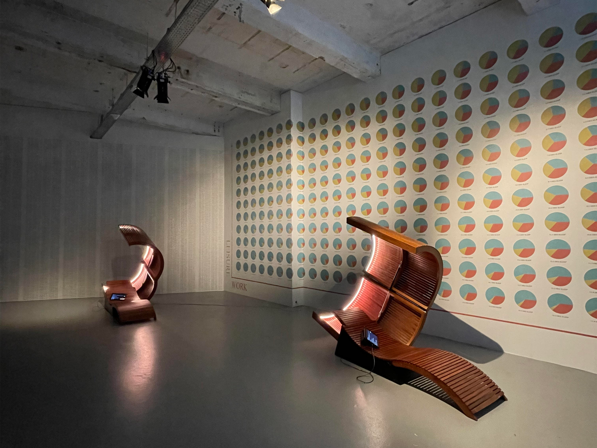
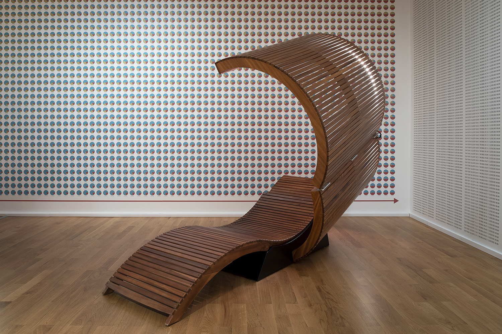

##### 2021 - smartphone app, sound, custom reclining furniture, climate model, wallpaper, prints on dibond

[https://perfectsleep.labr.io](https://perfectsleep.labr.io)

*Perfect Sleep* investigates sleep and dreaming as a potential climate engineering technology. By inviting participants to experiment with their own sleep cycles, the work explores how lack of sleep and climate change are both products of the same extractivist capitalist system where regeneration, rest and natural limits go unvalued.

The work is realized in two parts: as a smart phone app and an installation.

The app, titled *The Perfect Sleep App*, allows users to adjust their sleep schedule, slowly increasing their sleep time over the course of three years until they achieve a state of ‘total sleep’. To assist users in falling asleep, we have commissioned a series of dream incubation texts from Simone Browne, Johanna Hedva, Holly Jean Buck and Sophie Lewis that invite sleepers to dedicate their dreamspace to envisaging a world beyond our own. These texts have been transformed into dreamscapes by composer Luisa Pereira. 

[Download the app for iOS here.](https://apps.apple.com/us/app/the-perfect-sleep-app/id1582030021)

In the installation, titled *Sleep Study*, the dreamscapes can be experienced from custom daybeds. The design of this reclining furniture takes inspiration from the deck chairs of Thomas Mann’s novel, *The Magic Mountain* - where tubercular patients doze awaiting a cure - and from the sleeping pods of Silicon Valley, where sleep is seen as another parameter to be optimized in the unending pursuit of excessive wealth and power. 

The work was awarded an Award of Distinction at Ars Electronica in 2022. 

###### Photo: Michael Habes

###### Photo: Angelique Spaninks

###### Photo: Michael Habes

###### Photo: Michael Habes

### Credits

Dream Incubation texts: [Simone Browne](https://en.wikipedia.org/wiki/Simone_Browne), [Johanna Hedva](https://johannahedva.com/), [Holly Jean Buck](https://www.geo.design/) and [Sophie Lewis](https://twitter.com/reproutopia).

Dreamscape sound composition: [Luisa Pereira](https://www.luisapereira.net/).

Dreamscape narration: Mukundwa Katuliiba.

Furniture design in collaboration with [Jordana Maisie Design Studio](https://www.jordanamaisie.com/).

Commissioned by Museum Sinclair-Haus, Bad Homburg for the TEMPO exhibition, 26. September 2021 - 6. February 2022.