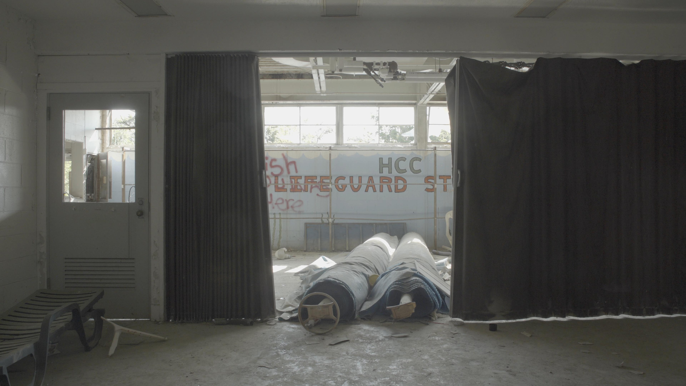

#### video

<iframe title="vimeo-player" src="https://player.vimeo.com/video/461651335?h=2a7a9c67f3" width="640" height="360" frameborder="0" referrerpolicy="strict-origin-when-cross-origin" allow="autoplay; fullscreen; picture-in-picture; clipboard-write; encrypted-media; web-share"   allowfullscreen></iframe>

Tega Brain and Sam Lavigne discussed data, AI, and IBM’s toxic legacies with filmmaker Hannah Jayanti while exploring the abandoned IBM Country Club in Endicott, New York.

IBM began its operations in Endicott in 1911, and opened its country club in the 1930s amidst the company’s expanding manufacture of punch card and accounting machines: data technologies that would go on to be used by Hitler’s Third Reich. The country club is preemptive of the modern day “tech campus” with swimming pools, tennis courts and luxurious recreational facilities for employees and their families. IBM closed its operations in Endicott decades ago, but left behind a toxic plume of chemicals in the town’s groundwater that is still impacting local communities today.

For further reading on IBM’s legacy in Endicott, read [In the Shadow of Big Blue](https://logicmag.io/nature/in-the-shadow-of-big-blue/), by Ellyn Gaydos, published in Logic Magazine.

###### Film still. ‘Tega Brain and Sam Lavigne, 2020, Sacrifice Zone.’

###### Film still. ‘Tega Brain and Sam Lavigne, 2020, Sacrifice Zone.’

###### Film still. ‘Tega Brain and Sam Lavigne, 2020, Sacrifice Zone.’

###### Film still. ‘Tega Brain and Sam Lavigne, 2020, Sacrifice Zone.’

###### Film still. ‘Tega Brain and Sam Lavigne, 2020, Sacrifice Zone.'

### Credits

Filming and editing by [Hannah Jayanti](http://hannahjayanti.com/).

Commissioned by [Ars Electronica](https://ars.electronica.art/keplersgardens/en/abandoned/).

This work was realised within the framework of the European ARTificial Intelligence Lab with support of the Creative Europe Culture Programme of the European Union.
