##### 2016 - dating service, installation

[https://smell.dating](https://smell.dating)

Smell Dating is the world’s first smell based dating service that invites people to find new connections using only their noses.

*1. We send you a t-shirt. 2. You wear the shirt for three days and three nights without deodorant. 3. You return the shirt to us in a prepaid envelope. 4. We send you swatches of t-shirts worn by a selection of other individuals. 5. You smell the samples and tell us who you like. 6. If someone whose smell you like likes the smell of you too, we’ll facilitate an exchange of contact information. 7. The rest is up to you.*

Smell is one of the most poignant and evocative experiences afforded by the human sensory apparatus and much can be gleaned from a potential mate’s smell. There is a growing body of research that suggests a person's gender, age, and predisposition to illness may be detected from their "smell signature.” Some researchers even speculate that high contemporary divorce rates may be related to the overuse of deodorants and the underuse of our natural olfactory intelligence. Smell Dating invites participants to trust their olfactory intuition and choose dates based on ancient molecular cues.

The work is performed as a participatory dating service and has also been realized as a gallery installation.

<iframe title="vimeo-player" src="https://player.vimeo.com/video/155320646?h=e416440ceb" width="640" height="360" frameborder="0" referrerpolicy="strict-origin-when-cross-origin" allow="autoplay; fullscreen; picture-in-picture; clipboard-write; encrypted-media; web-share"   allowfullscreen></iframe>

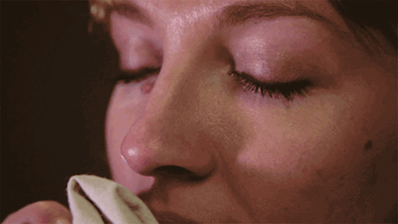

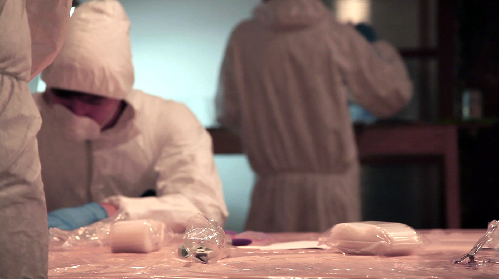
###### Smell Dating, New York

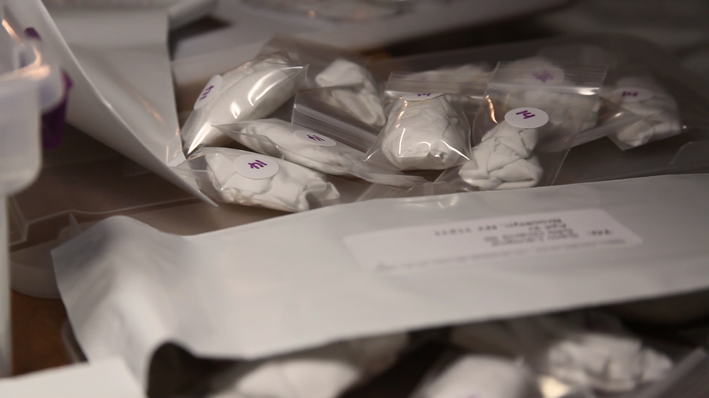
###### Smell Dating, New York

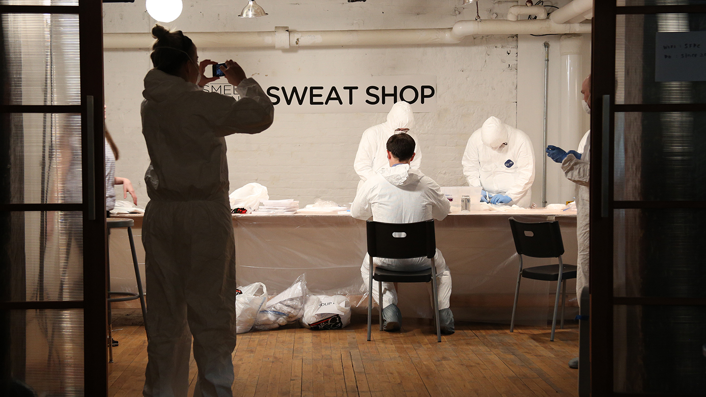
###### Smell Dating, New York

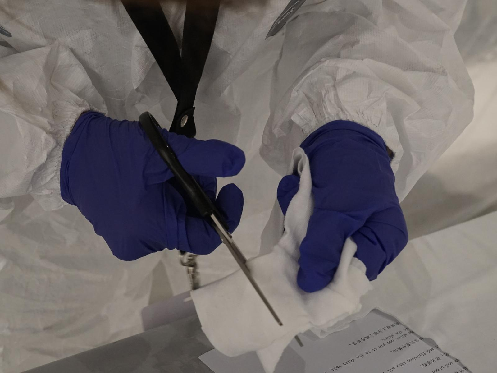
###### Smell Dating, New York

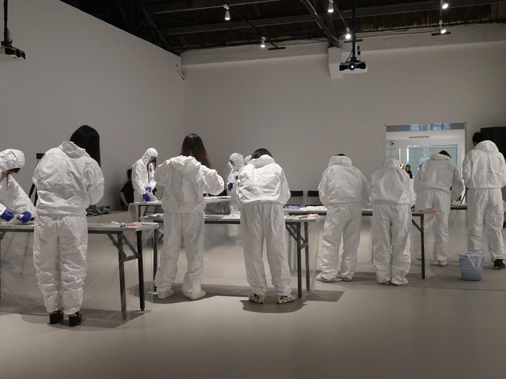
###### Smell Dating, Chronus Art Center, Shanghai

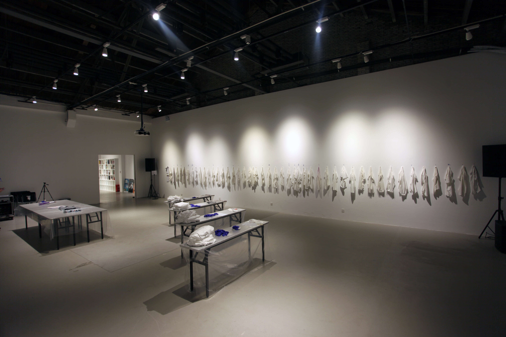
###### Smell Dating, Chronus Art Center, Shanghai

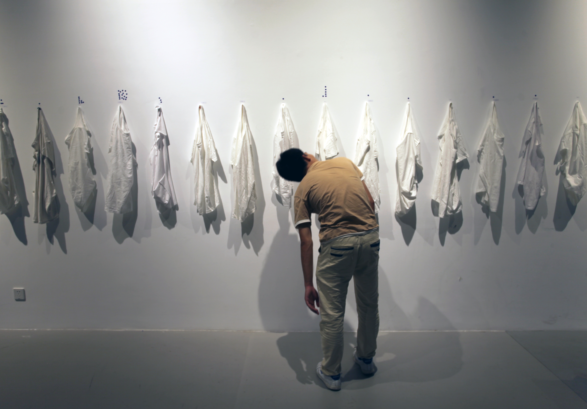
###### Smell Dating, Chronus Art Center, Shanghai

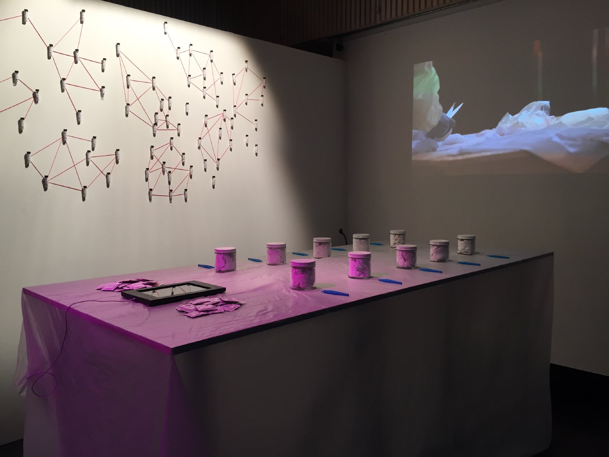
###### Smell Dating, IDFA, Amsterdam

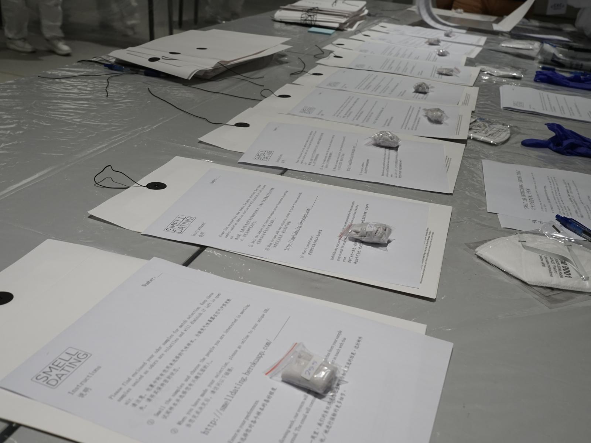

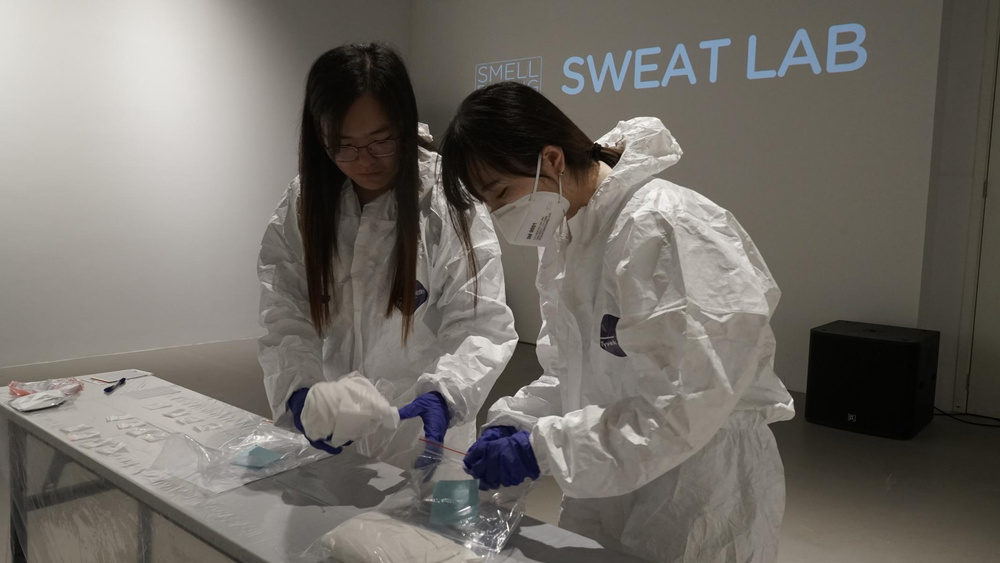

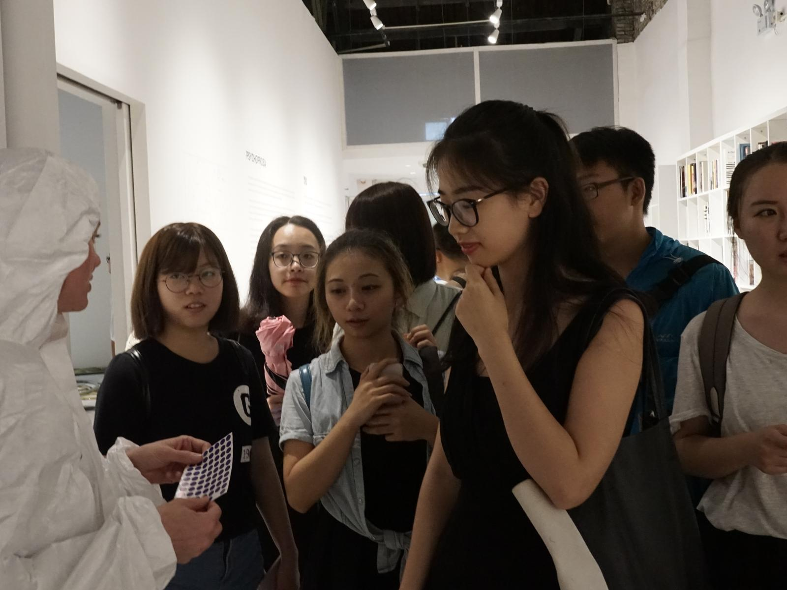

<iframe title="vimeo-player" src="https://player.vimeo.com/video/163888525?h=ed9ba18c57" width="640" height="360" frameborder="0" referrerpolicy="strict-origin-when-cross-origin" allow="autoplay; fullscreen; picture-in-picture; clipboard-write; encrypted-media; web-share"   allowfullscreen></iframe>

###### Press supercut (video by Tega Brain)

### Press/External
*Featured in The Guardian US, Huffington Post, Buzzfeed, The Ellen DeGeneres Show, The New York Observer, Fox8, Reuters TV, Al Jazeera, The Creators Project, HuffPost Love and Sex Podcast, ABC News, Time Magazine, The Times of India, Glamour Magazine, Marie Claire, Time Out New York, Time Magazine, Gizmodo, Brooklyn Paper, Il Fatto Quotidiano, Irish Examiner, Radio Hamburg, Australian Broadcasting Corporation, Fortune, Daily Mail, New York Daily News, Tech Insider, South China Morning Post, Vice Japan.*

[The Guardian](https://www.theguardian.com/lifeandstyle/2016/apr/27/smell-dating-does-sniffing-out-potential-lovers)

[Huffington Post](http://www.huffingtonpost.com/entry/smell-dating-experiment_us_571e37e6e4b0d4d3f723de47)

[Buzzfeed](https://www.buzzfeed.com/katienotopoulos/are-you-stinky-enough-to-try-a-new-dating-site-based-on-your)

[The Ellen DeGeneres Show](https://www.youtube.com/watch?v=8JIE5cI4cZs)

[New York Observer](http://observer.com/2016/04/smell-dating-startup/)

[Reuters](http://www.reuters.com/article/us-usa-bodyodor-idUSKCN0WQ1K7)

[Vice - The Creators Project](https://www.vice.com/en/article/smell-dating-service/)

[Marie Claire](https://www.marieclaire.co.uk/life/sex-and-relationships/smell-dating-is-this-the-next-trend-17874)

[Time Magazine](http://time.com/smell-dating-4/)

[Brooklyn Paper](http://www.brooklynpaper.com/stories/39/15/dtg-smell-dating-2016-04-08-bk.html)

[Australian Broadcasting Corporation](http://www.abc.net.au/news/2016-05-28/smell-dating-swaps-tinder-for-smelly-t-shirts/7444134)

### Credits

Thanks to the [Useless Press](http://uselesspress.org/), [Imp Kerr](http://impkerr.com/), ITP NYU, School for Poetic Computation, Bruce Kimball from Monell Labs and Amy R. Gordon from Karolinska Institutet. 

