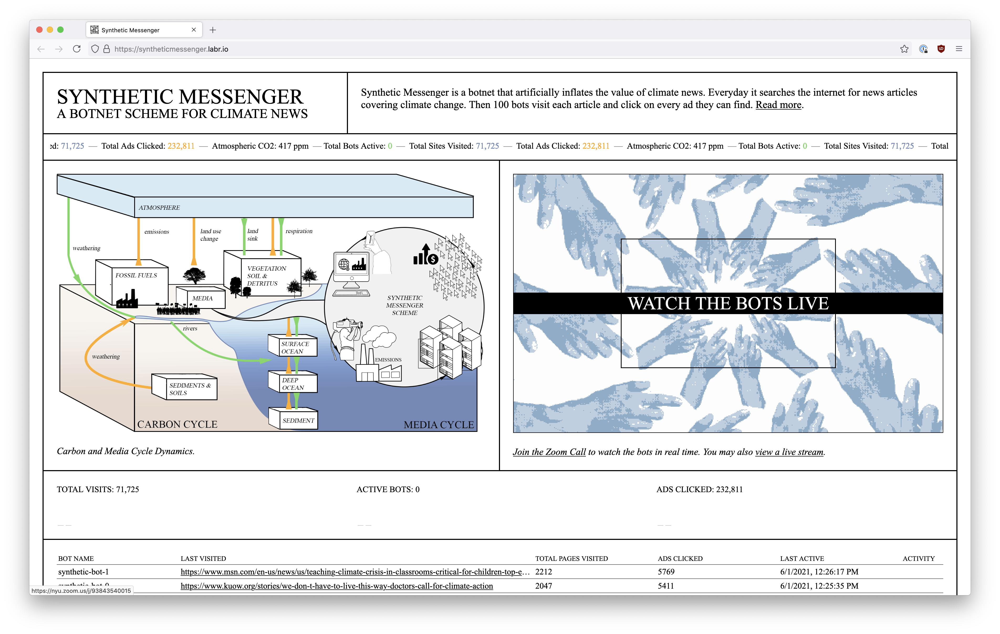
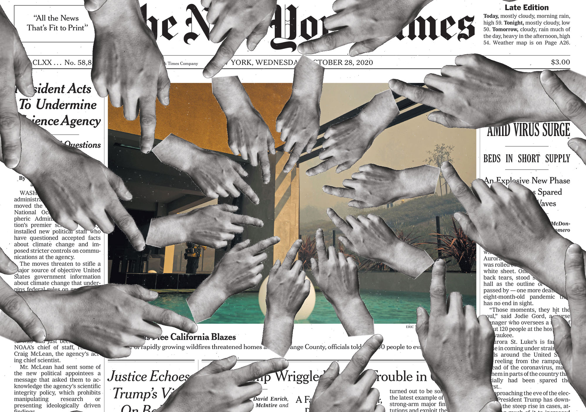
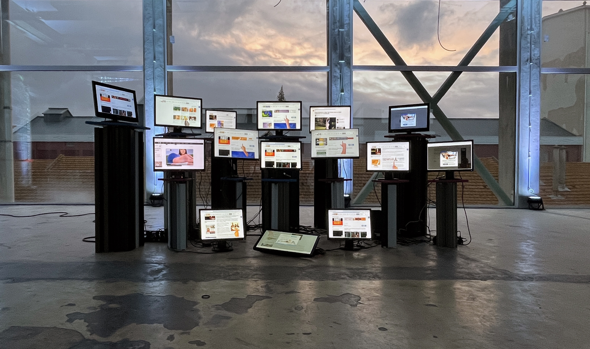
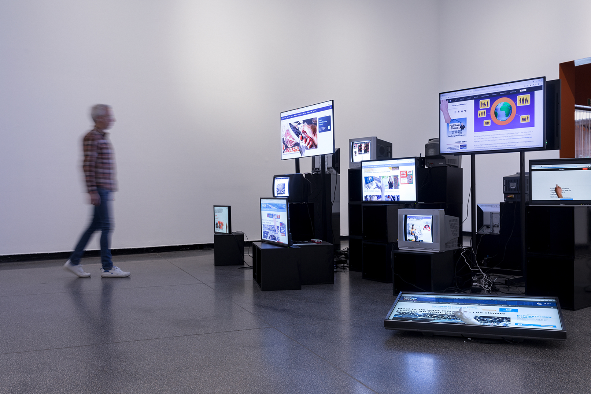
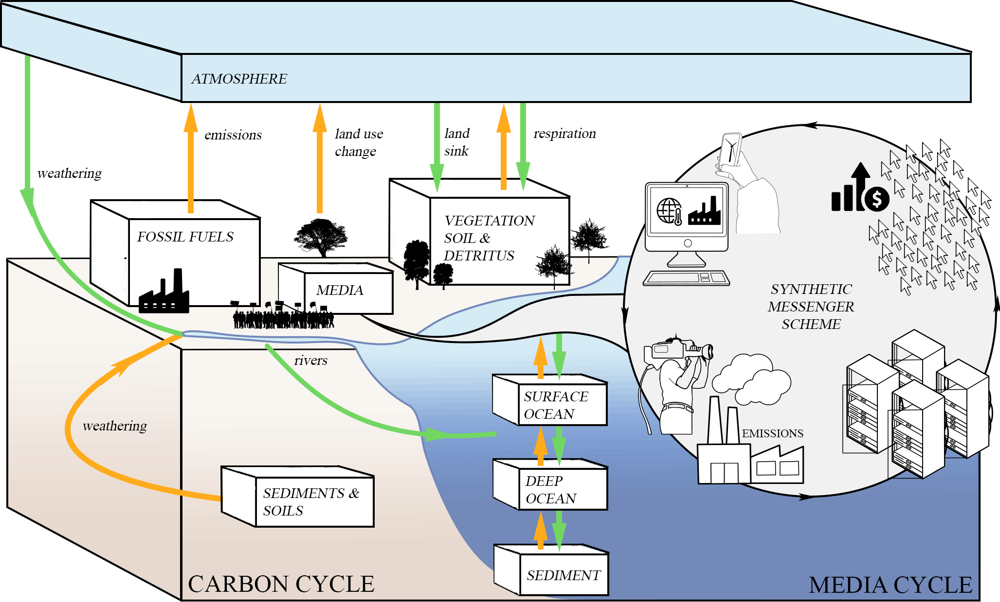

##### 2021 - web, zoom

[https://syntheticmessenger.labr.io/](https://syntheticmessenger.labr.io/)

Synthetic Messenger was a botnet performance that attempted to artificially inflate the value of climate news. Every day the system searched the internet for news articles covering climate change. Then 100 bots visited each article and clicked on every ad they could find.

The performance ran for two weeks, and took place inside of a Zoom call that was available to the public. 

Read more about the project in [The Battle to Control the Media Cycle](https://dingdingding.org/issue-4/the-battle-to-control-the-carbon-media-cycle/) published in Ding Magazine.

<iframe title="vimeo-player" src="https://player.vimeo.com/video/561052061?h=2842fdd5c7" width="640" height="360" frameborder="0" referrerpolicy="strict-origin-when-cross-origin" allow="autoplay; fullscreen; picture-in-picture; clipboard-write; encrypted-media; web-share"   allowfullscreen></iframe>

<iframe width="824" height="464" src="https://www.youtube.com/embed/RlFW1gL6AGU" title="Synthetic Messenger Performance 4" frameborder="0" allow="accelerometer; autoplay; clipboard-write; encrypted-media; gyroscope; picture-in-picture; web-share" referrerpolicy="strict-origin-when-cross-origin" allowfullscreen></iframe>

### Credits

This project has been supported by the Goethe-Institut's New Nature Program (2020) and by the 2021 STRP Festival.

With thanks to Dr. Simon David Hirsbrunner for collaborating on the background research, and everyone who contributed their hands: Dominique McBride, Corin Faife, Lauren Lee McCarthy, Daniel Shiffman, Jackie Hasa, Martin Walsh, Djoeke Schoots, Andrei Stoica, Cubiton, Elizabeth Henaff, Andrew Lau, Regine Gilbert, Royce Brain, Loretta Moy, Yeseul Song, Brian Clifton, Orion Kellogg, Masha Kouznetsova, Zlatica Hasa.

### Press/External

[Vice](https://www.vice.com/en/article/wx5jk5/an-army-of-100-bots-is-reading-climate-change-news-and-clicking-every-ad-along-the-way)

[Der Spiegel](https://www.spiegel.de/wissenschaft/technik/klima-wie-100-bots-der-klimakrise-zu-mehr-aufmerksamkeit-verhelfen-sollen-a-26d00885-7986-4b66-8072-65194336b700)

[Gizmodo](https://gizmodo.com/this-bot-clicking-ads-on-climate-articles-shows-the-new-1847123170)

[Ding Magazine](https://dingdingding.org/issue-4/the-battle-to-control-the-carbon-media-cycle/)

### Exhibitions

The Irreplaceable Human – the Conditions of Creativity in the Age of AI, Louisiana Museum of Modern Art, Denmark.
Nov 23 - April 1, 2024.

Taoyuan Art x Technology Festival, Taoyuan Arts Center, Taiwan. September 22 - October 29, 2023.

Data Relations, Australian Center for Contemporary Art, Melbourne. 10 Dec 2022–19 Mar 2023.

Distant Early Warnings, Gray Area, San Fransisco.
Sept 29 – Oct 30th, 2022.

Sonar Festival, Lisboa.
April 8 to April 11, 2022.

STRP Expo, Eindhoven (online).
June 3-6, 2021.
