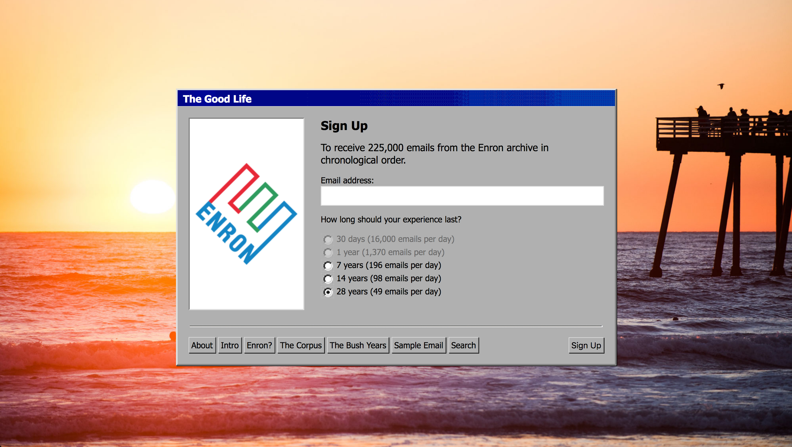
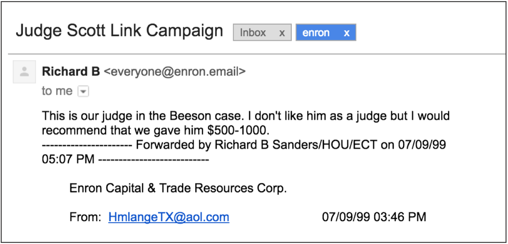

##### 2017 - online, email

[https://enron.email/](https://enron.email/)

The Enron scandal was, as of 2004, the largest bankruptcy in American history and is a prescient example of corporate fraud and audit failure. The Good Life offers a unique opportunity to experience this landmark event from the inside. Users may sign up to receive 225,000 emails confiscated from Enron by the Federal Energy Regulatory Commission, direct to their inbox. The emails arrive in the order they were sent, over the course of 7, 14, or 28 years.

###### The Good Life sign up form

###### A sample email

Commissioned by Rhizome and published online as a part of the First Look Series of the New Museum, NYC. The project was also the catalyst for event, The Making of Natural Language, An Evening with the Enron Email Archive held on October 6, 2017 at the New Museum. 

<iframe title="vimeo-player" src="https://player.vimeo.com/video/239863377?h=b24a1523ff" width="640" height="360" frameborder="0" referrerpolicy="strict-origin-when-cross-origin" allow="autoplay; fullscreen; picture-in-picture; clipboard-write; encrypted-media; web-share"   allowfullscreen></iframe>

### Press / External

[Japan Media Arts Festival (Jury Selection)](https://j-mediaarts-festival.bunka.go.jp/en/award/single/the-good-life/index-2.html)

[Creative Applications Network](http://www.creativeapplications.net/news/corporate-malfeasance-as-service-the-enron-email-simulator/)

[Creators Project](https://www.vice.com/en/article/enron-500000-email-experiment/)

[Technically](https://technical.ly/brooklyn/2016/11/22/enron-emails-good-life-art/)
