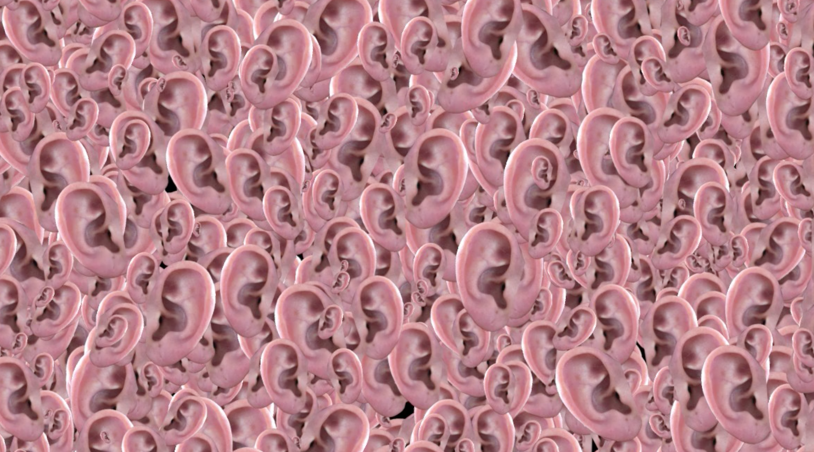
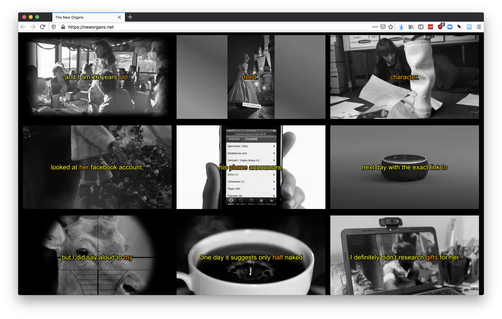
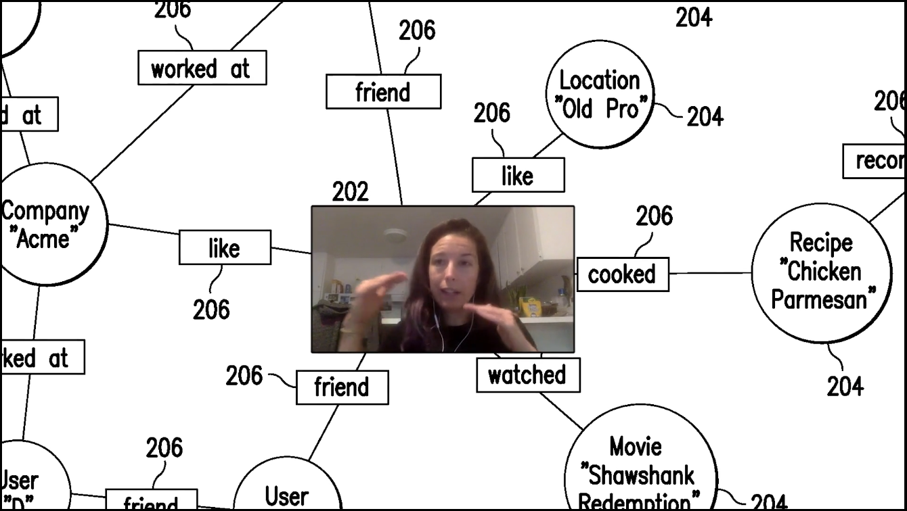
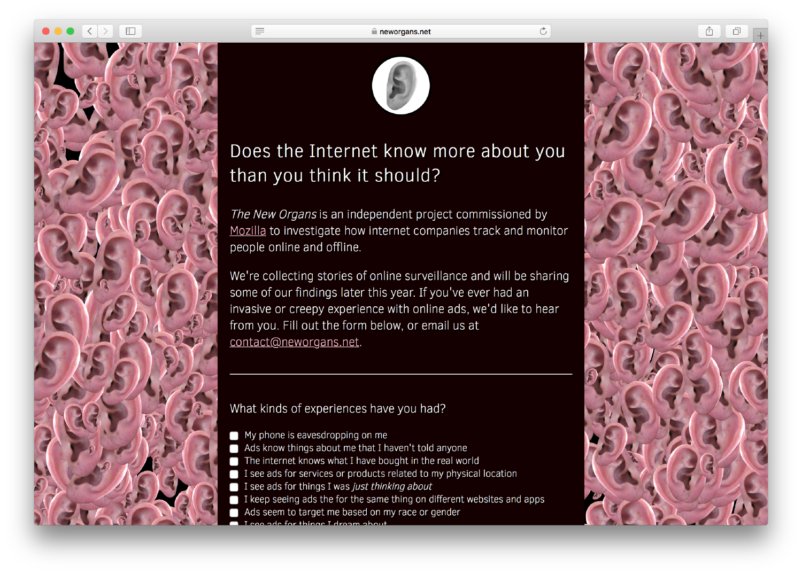

##### 2018 - online, survey, video archive, dataset, single channel video (10.10min)

[https://neworgans.net](https://neworgans.net)

*The New Organs* is an ongoing project to gather, archive and investigate the theories and realities of corporate surveillance. 

Is the internet listening in on you? Having weird experiences with online ads? [Contribute your story](https://neworgans.net/submit.html) to the New Organs Archive.

[The New Organs](https://neworgans.net/) gathers, archives and investigates personal experiences and theories of corporate digital surveillance. Made in collaboration with Sam Lavigne, the project began with a public call for stories about people’s weird experiences with online ads — ads that seem to know too much — as well as their theories of why they might be seeing them.

We received over 1000 responses and turned these stories into an online video archive detailing the rise of media systems driven by artificial intelligence.

What does the rise of surveillance capitalism feel like?

###### Screenshot of video archive. ‘Tega Brain and Sam Lavigne- New Organs, 2018.’ 

Using these stories as a starting point, we also made a [short film](https://neworgans.net/) that investigates the details of how internet companies track, exploit, target and manipulate us in an attempt to understand how surveillance capitalism operates.

###### Still from an interview with Kashmir Hill in The New Organs. ‘Tega Brain and Sam Lavigne- New Organs, 2018.’

<iframe title="vimeo-player" src="https://player.vimeo.com/video/301298867?h=1f34113d1a" width="640" height="360" frameborder="0" referrerpolicy="strict-origin-when-cross-origin" allow="autoplay; fullscreen; picture-in-picture; clipboard-write; encrypted-media; web-share"   allowfullscreen></iframe>

### Press

[Oscar Schwartz](https://theoutline.com/contributor/359/oscar-schwartz) for The Outline, [“Digital Ads Are Starting to Feel Psychic”](https://theoutline.com/post/5380/targeted-ad-creepy-surveillance-facebook-instagram-google-listening-not-alone)

### CREDITS

The New Organs was commissioned by [Mozilla](https://blog.mozilla.org/internetcitizen/2018/06/21/is-your-smartphone-listening-to-you-probably-not-but-we-still-want-to-hear-from-you/).

### EXHIBITIONS

[Surveillance: From Vision to Data](https://chsi.harvard.edu/surveillance)
The Collection of Historical Scientific Instruments,
Harvard University, Cambridge, MA
Sept 21 - Jun 23 2024

Fun Palace 
C2 Space,  OCT-LOFT, Shenzhen
October 22 - December 31, 2019
