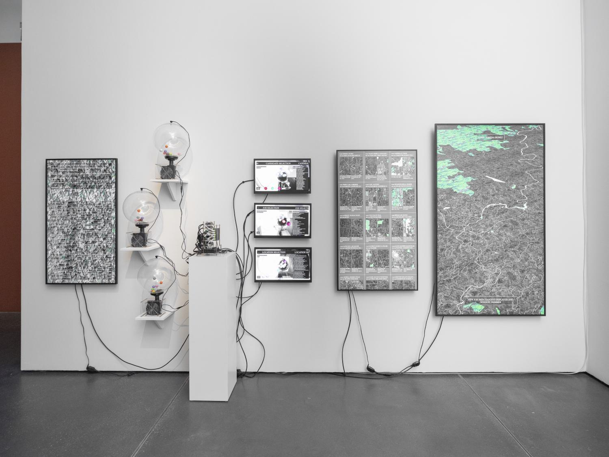
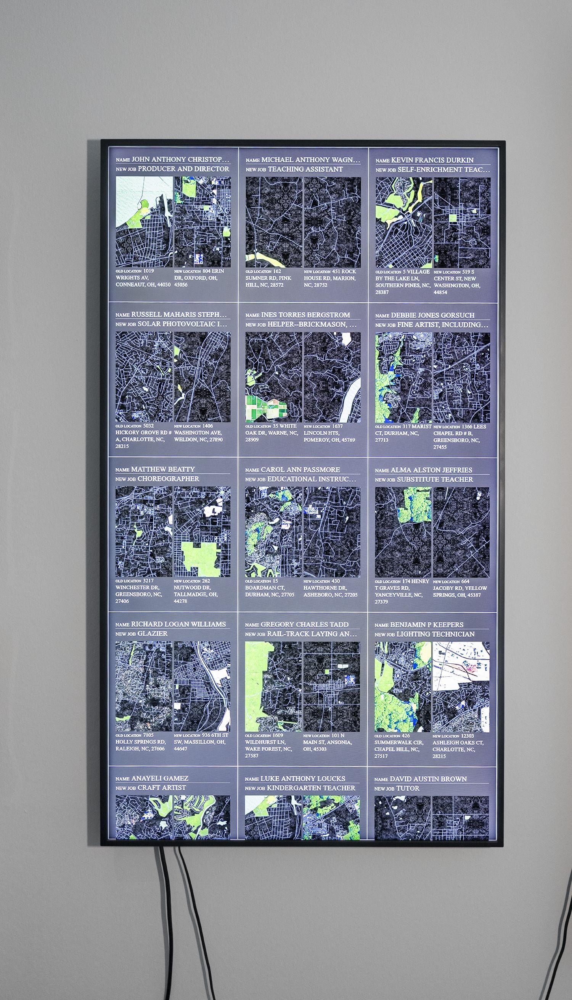
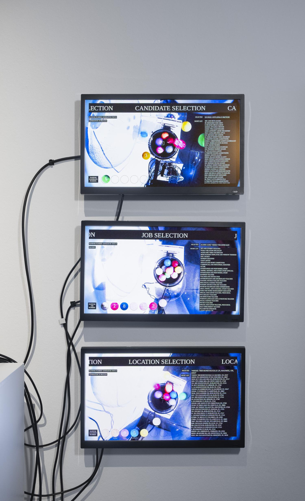
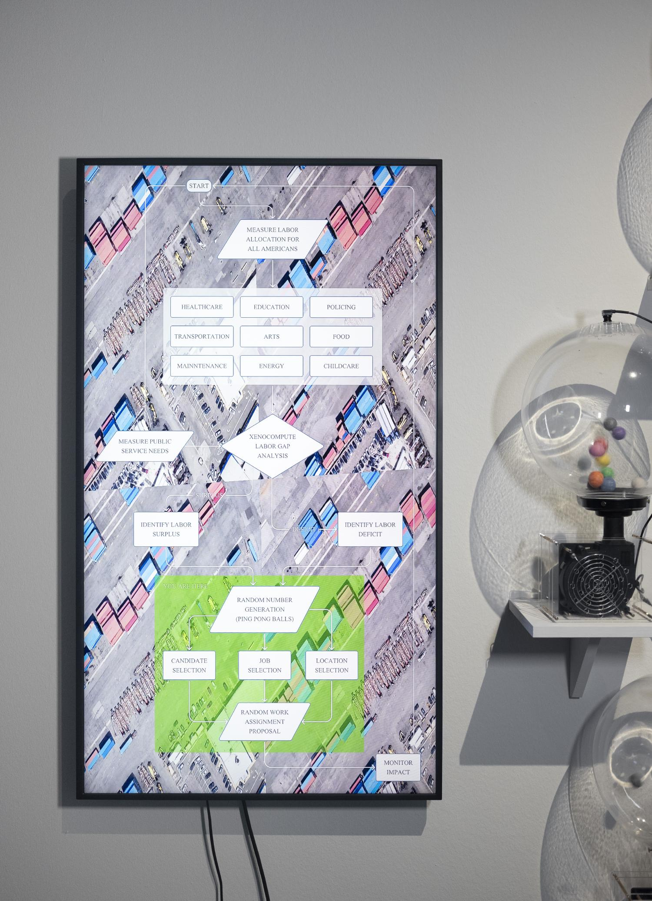
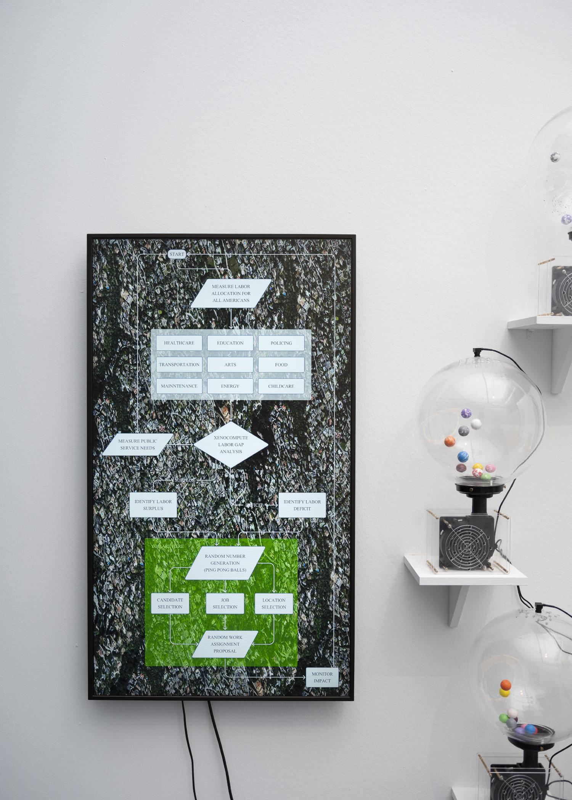
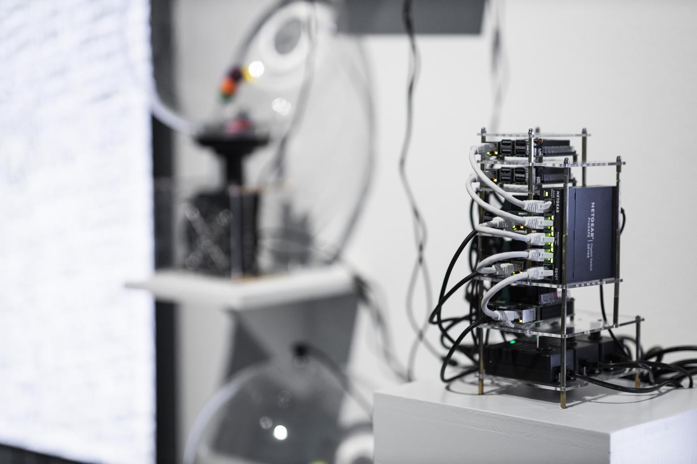

##### 2025 - raspberry pi cluster, random number machines, multi-channel visualization

A system that creates a new labor distribution for the US. The system is composed of three random digit generators made of air pumps and colored balls, a cluster of raspberry pi computers, and a dashboard that displays the status of the system and the locations of labor assignments. Random numbers generated by the system are used to select candidates and job assignments from a pool of 30 million Americans. 

###### Photo by Michel Klehm

In 1971 the Allende administration in Chile attempted to create a centralized computer system called Cybersyn to manage the country’s socialist economy. Unfortunately the government was overthrown in a US-backed coup before the project could be fully realized. A few years later in 1974, Ursula K. Le Guin published “The Dispossessed”, a science fiction novel that also imagines an alternative computational economy, that of an alien anarchist society living on the moon of Anarres. On Anarres there is no money, no property, or government and it is the computers of DivLab that manage “the administration of things, the division of labor, and the distribution of goods.” Both Cybersyn and DivLab are evocative reminders that contemporary horizons for computation and artificial intelligence are shaped by specific economic contexts. In western centers of power these are contexts marked by decades of neoliberal governance and capitalism, where markets are called upon to drive transformation and where the exploitation of labor is incentivized, resulting in vast inequality in wealth and power. It is of little surprise then that the current imaginary for AI is for it to deskill, automate or outsource the activities of workers while also obscuring accountability for decision makers. How might alternative economic contexts lead to other horizons for computation and thereby shape human subjectivity into new forms?

Xenocomputing picks up where Allende and Le Guin leaves off. It takes seriously the challenge of imagining and implementing an alternative computational system. The resultant Xeno Computer creates a new labor distribution for the US.
 

###### Photo by Michel Klehm

###### Photo by Michel Klehm

###### Photo by Michel Klehm

###### Photo by Michel Klehm

###### Photo by Michel Klehm

###### Photo by Michel Klehm

###### Photo by Michel Klehm

###### Photo by Michel Klehm

### Credits:

Installation assistance: Fletcher Bach

Commisssioned by Werkleitz for the [Planetarische Bauern](https://werkleitz.de/en/planetarische-bauern-ausstellung) (Planetary Peasants) project.

